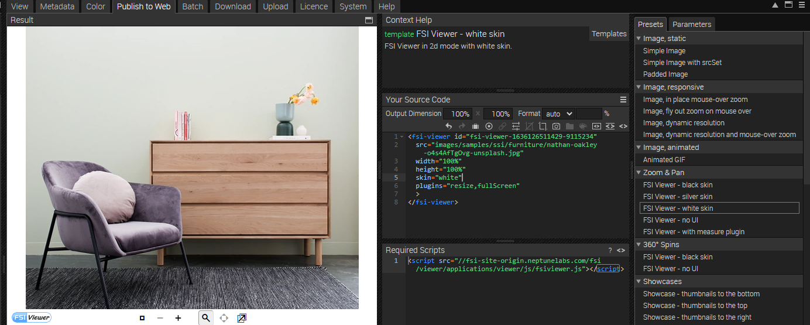
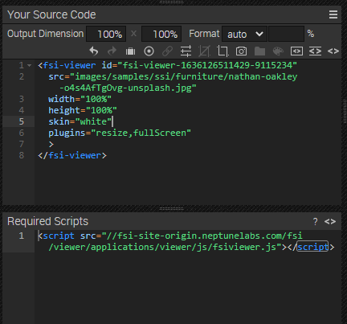

# Using FSI Pages for Catalogs - Modal Version

This readme describes how the detail page sample with *FSI Pages* in a modal is achieved.
The aim of the demo is to show how you can easily integrate images as a catalog by just adding
a simple viewer tag.
Please note that this sample uses the Bootstrap modal.

# Add your images/ assets to FSI Server

First, you'll need to upload the images you want to use to FSI Server.
You can install a [demo version](https://www.neptunelabs.com/get/) via Docker or use our [online demo server](https://demo.fsi-server.com/fsi/interface/) to try it out first.

It's important to use the correct source connector for your images:

- *Storage*: images will be imported to the storage for high performance Single Source Imaging
- *Static*: for static files only, e.g. style graphics you want to use on your website

# Uploading images

Depending on the type of the selected source connector, you can upload different types of files. There are several possibilities to upload images into the interface.


- Choose the Upload tab, click the "Choose files" button to add files to upload to the list. The files will be uploaded to the current folder.
- Drag & Drop files to the file view or the tree view

# Add a static image as thumbnail to website - modal on click

Next, we will add an image which will open a modal on click. Please keep in mind we are using the Bootstrap modal technique.

```html
 <h3>Browse through our catalog:</h3>
<div data-bs-toggle='modal' data-bs-target='#exampleModal'>
  
</div>
```

The modal itself is defined at the end of the <main> section.
The data-bs-target as seen above has to have the same name as the ID of your modal div.


```html
  <div id='exampleModal' class='modal fade bd-example-modal-xl' tabindex='-1' role='dialog'
       aria-labelledby='myExtraLargeModalLabel' aria-hidden='true'>
  <div class='modal-dialog modal-xl'>
    <div class='modal-content'>
      <div class='modal-header'>
        <button type='button' class='btn-close' data-bs-dismiss='modal' aria-label='Close'></button>
      </div>
      <div class='modal-body'>
        <fsi-pages
          id='fsi-pages-1629127147793-9455915'
          dir='images/samples/pages/product'
          width='100%'
          height='600px'
          pageLayout='flip'
          skin='example'
          listTemplate='catalog_list'
          plugins='resize,fullScreen'
        >
        </fsi-pages>
      </div>
    </div>
  </div>
</div>
```
The modal-body also contains the basic FSI Pages tag.
The next section shows how you extract the pages tag from FSI Server.

# Use catalogs on the website

While having an image or a folder selected, you can see all possible publishing ways for the specific item by visting the Publish To Web tab.
For this example, select the preset *Catalog with flip layout* in the section *E-Books/ E-Catalogs*:



The *Source Code* section enables you to control the look of your viewer by setting the dimensions and format, as well as adding effects, different parameters or crop options to it.
In this area you also can see the source code for your selected publishing option which you can edit and copy to publish the viewer.
You also see the required scripts which need to be embedded on the site.



In order to display catalogs with FSI Pages, you only need to add the corresponding script
to the head of your website:

```html
<script
  src='https://docs.neptunelabs.com/fsi/viewer/applications/pages/js/fsipages.js'
</script>
```
This ensures that FSI Pages is loaded.

Afterwards, you need to place the *<fsi-pages>* tag you see in the Publish section in the modal body.
In our example this will look like this, as seen above:

```html
 <fsi-pages
  id='fsi-pages-1629127147793-9455915'
  dir='images/samples/pages/product'
  width='100%'
  height='600px'
  pageLayout='flip'
  skin='example'
  listTemplate='catalog_list'
  plugins='resize,fullScreen'
>
</fsi-pages>
```

For all parameters which can be used, please consult the [manual](https://docs.neptunelabs.com/fsi-viewer/latest/fsi-pages).

## Testing with examples from your own server

To test the examples with images from your own [FSI Server](https://www.neptunelabs.com/fsi-server/), please first copy the env.yml.dist file to env.yml and adapt the file, then restart the main demo again.
