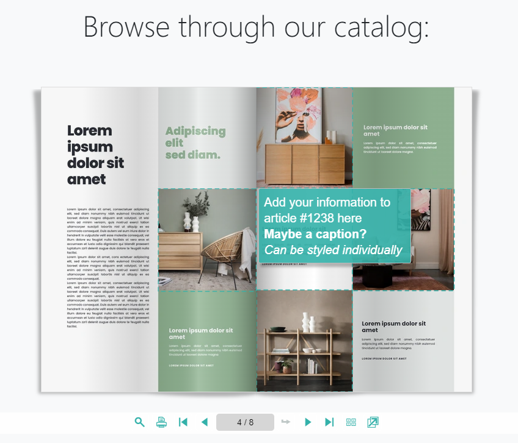

# Using FSI Pages for Catalogs - with hyperlinks

This readme describes how to achieve the detail page example with _FSI Pages_ displaying hyperlinks.
The aim of the demo is to show how you can easily integrate images as a catalogue by adding a simple viewer tag.

To display catalogues with FSI Pages, all you need to do is add the following script
to the head of your page:

```html
<script
  src='https://fsi.domain.tld/fsi/viewer/applications/pages/js/fsipages.js'
</script>
```

This ensures that FSI Pages is loaded.

Then you need to place the `<fsi-pages>` tag in the body.
In our example this will look like this:

```html
<fsi-pages
  id="fsi-pages-1629127147793-9455915"
  dir="images/samples/pages/product"
  width="100%"
  height="600px"
  pageLayout="flip"
  skin="example"
  listTemplate="catalog_list"
  plugins="resize,fullScreen"
>
</fsi-pages>
```

## Hyperlinks

For this demo, we've added hyperlinks to the catalogue. You can see them by hovering over the marked areas:



You can add these links using FSI Server's hyperlink editor.

For a detailed explanation of how this works, please visit [the tutorial "How to use the Hyperlink Editor"](https://www.neptunelabs.com/fsi-pages-js/how-to-use-the-hyperlink-editor/).

For all parameters which can be used, please consult the [manual](https://docs.neptunelabs.com/fsi-viewer/latest/fsi-pages).

## Testing with examples from your own server

To test the examples with images from your own [FSI Server](https://www.neptunelabs.com/fsi-server/), please first copy the env.yml.dist file to env.yml and adapt the file, then restart the main demo again.
