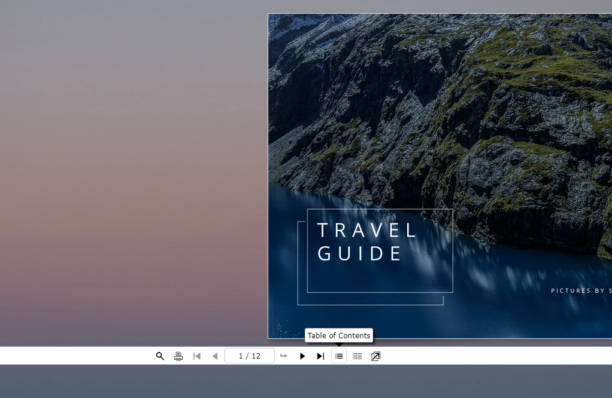

# Using FSI Pages for Catalogs - with chapters

This readme describes how to achieve the detail page example using _FSI Pages_ with chapters.
Adding the parameter `plugins:"Chapters"` adds a select box to the user interface of FSI Pages.
The user can directly access chapters of a catalogue by selecting the corresponding item in the select box.

To display catalogues with FSI Pages, simply add the following script to the head of your website:

```html
<script
  src='https://fsi.domain.tld/fsi/viewer/applications/pages/js/fsipages.js'
</script>
```

This will ensure that FSI Pages is loaded.

Then you need to place the `<fsi-pages>` tag in the body.
In our example this looks like this:

```html
<fsi-pages
  id="fsi-pages-1629127147793-9455915"
  dir="images/samples/pages/travel"
  width="100%"
  height="600px"
  pageLayout="flip"
  skin="white"
  listTemplate="catalog_list"
  plugins="resize,fullScreen,chapters"
>
</fsi-pages>
```

## Chapters

We've added chapters to the catalogue for this demo. You can view them by clicking on the **Table of Contents** button in the menu bar:



They are added by enabling the plugin by adding it as a plugin parameter: `plugins='resize,fullScreen,chapters'` and adding the following to the `<fsi-pages>` tag:

```html
<!-- the code below provides the data for the "chapters" plug-in -->
<fsi-pages-chapters style="display:none">
  <chapter page="1">Cover</chapter>
  <chapter page="2">
    New Zealand
    <chapter page="2">Mangaotaki Valley</chapter>
    <chapter page="3">Sutherland Falls</chapter>
    <chapter page="4">Fjordland National Park</chapter>
    <chapter page="5">O'Neill Bay</chapter>
  </chapter>
  <chapter page="6">
    Switzerland
    <chapter page="6">Monte Tamaro</chapter>
    <chapter page="7">Monte Rosa</chapter>
    <chapter page="8">Matterhorn</chapter>
    <chapter page="9">Zermatt</chapter>
    <chapter page="10">Oberhofen Castle</chapter>
    <chapter page="11">Lucerne</chapter>
  </chapter>
</fsi-pages-chapters>
```

For all parameters which can be used, please refer to the [manual](https://docs.neptunelabs.com/fsi-viewer/latest/fsi-pages).

## Testing with examples from your own server

To test the examples with images from your own [FSI Server](https://www.neptunelabs.com/fsi-server/), please first copy the env.yml.dist file to env.yml and adapt the file, then restart the main demo again.
